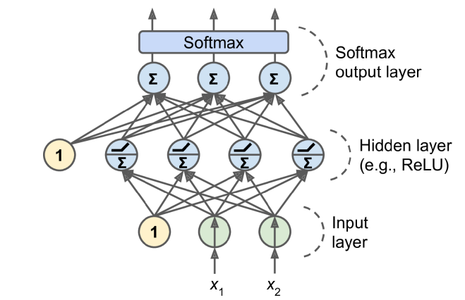

# 정재현

<<<<<<< HEAD
## clustering

### K-means Clustering

우리는 cluster가 3개임을 알고있다. (픽토그램, 일러스트레이션, 스케치) 그리고 여기에 실제 사진, 또는 다름 사진이 noise로 들어있다. 

### Agglomerative clustering

### Hierarchical Clustering and Dendrograms

### DBSCAN

## evaluate clustering

DBSCAN은 cluster에 포함되지 않는 데이터를 얻을 수 있다.

### ARI

나쁘다고 판단. 실제로 필토그램, 일러스트레이션, 스케치에 대한 타켓 정보가 없으므로 실제 사진을 추출하는데 사용할 수 없다.

### NMI

ARI와 같은 이유로 나쁘다고 판단.

### robustness-based

### silhouette coefficient

## f1-score

우선 f1-score를 이해하기 위해서는 TP, TN, FP, FN의 개념을 이해할 필요가 있다.  

**TP (True Positive) : Positive로 예측한 데이터 중에 실제로 Positive인 수** 
**TN (True Negative) : Negative로 예측한 데이터 중에 실제로 Negative인 수** 
**FP (False Positive) : Positive로 예측한 데이터 중에 실제로 Negative인 수** 
**FN (False Negative) : Negitive로 예측한 데이터 중에 실제로 Positive인 수** 

**즉, FP, FN은 잘못 예측한 경우이댜.**

> 여기서 Positive,와 Negative로 설명했다. 하지만 개를 Positive, 고양이를 Negative로 결정하는 방식으로 사용이 가능하다.
> 더 나아가, 0과 9의 숫자 이미지를 예측한다 생각해보자. 그리고 0을 Positive로 결정하면, 나머지 숫자는 Negative로 결정된다. 그리고 1을 Positive로 결정할 때도 동일하다.

### Precision

**Precision의 정의는 다음과 같다.** 
$Precision = \dfrac{TP}{TP + FP}$ 
**Precision은 Positive로 예측한 데이터 중에, 실제로 Positive인 데이터이다.**

### Recall

**Recall의 정의는 다음과 같다.** 
$Recall = \dfrac{TP}{TP + FN}$ 
**Recall은 실제 Positive 중에서, Positive로 예측한 데이터이다.**

### Precision과 Recall의 의미

그렇다면 Precision과 Recall은 왜 중요한가.  
**이는 암 예측으로 설명된다.** 
> 왜냐하면 환자가 암이 있는데 없다고 판단하는 경우가 가장 위험하기 때문이다. 따라서 Recall이 높으면 실제 암을 가지고 있는 사람들 중에서, 암을 가지고 있다고 판단할 확률이 높은 것이므로, 이를 metric으로 사용해야한다.

### f1-score

$F1 = \dfrac{2 \times Precision \times Recall }{Precision + Recall}$  

**결론부터 말하자면, f1-score는 Precision과 Recall의 조화평균이다.**
그렇다면 과제에서 Precision과 Recall의 조화평균을 사용하게 한 이유는 무엇인가.
작성자의 생각으로는 클래스를 균형있게 예측하기를 바라기 때문이라 생각한다.
**다음 예시를 생각해보자** 
> 고양이 사진 99개, 강아지 사진 1개의 테스트 데이터로 모델 성능을 평가한다고 생각하보자. 그리고 그 모델은 모든 데이터를 고양이라고 예측한다. 그러면 Accuracy는 99%지만 강아지의 Precision과 Recall은 0이다. 따라서 f1-score는 낮게 나올 것이다.

## Deep Learning

### train, validation, test data

 

 

### MLP(Multi-Layer Perceptron), FC(fully connected) Model

 

### Optimizer

 
=======
## f1-score

$Precision$
>>>>>>> 36ae001 (made file and methods')
