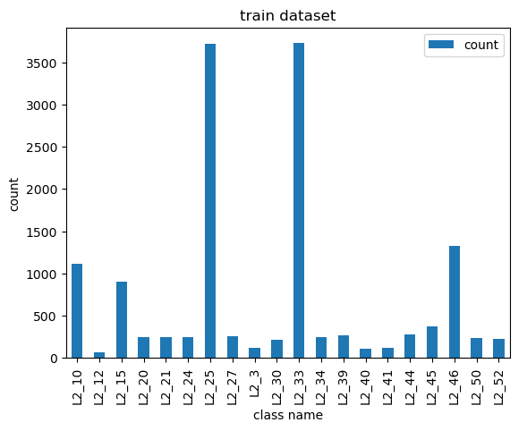
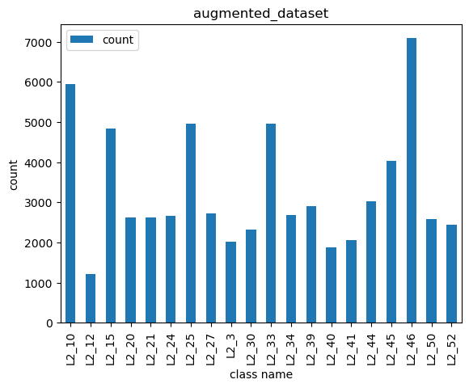
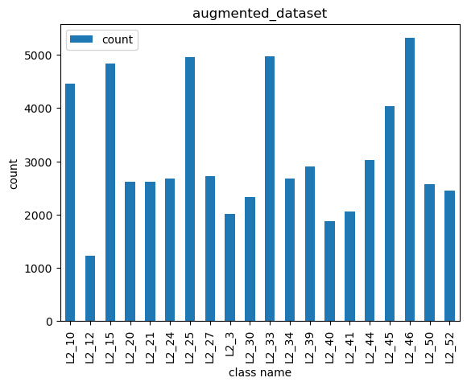
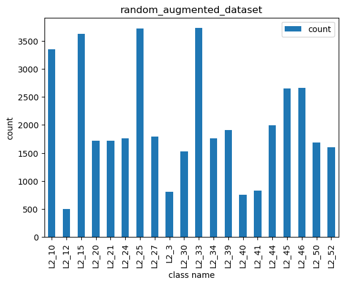

# Augmentation

## 1. 부족한 데이터 확인

이는 train, validation, test 데이터 분류시에 만들어진 barplot을 보면 알 수 있다.<br/>
<br/>

이를 보면 L2_25와 L2_33이 3500개 정도로 가장 많고 다음으로는 L2_10, L2_15, L2_46정도가 보인다. 그리고 나머지는 500개 조차 되지 않는다. 따라서 이 비율에 맞춰서 augmentation을 진행했다.

## 2. Augmentation Dictionary 작성

**다음과 같이 클레스에 어떤 augmentation을 적용할지 결정하는 Dictionary를 작성했다**<br/>
```python
gmt_dict = {
        'L2_10': [('rotate', 0), ('affine', None), ('rotate', 90), ('rotate', 180)],
        'L2_12': [('rotate', 0), ('affine', None), ('rotate', 30), ('rotate', 60), ('rotate', 90), ('rotate', 120), ('rotate', 150), ('rotate', 180), ('rotate', 210), ('rotate', 240), ('rotate', 270), ('rotate', 300), ('rotate', 330)],
        'L2_15': [('rotate', 0), ('affine', None), ('rotate', 90), ('rotate', 180)],
        'L2_20': [('rotate', 0), ('affine', None), ('rotate', 30), ('rotate', 90), ('rotate', 150), ('rotate', 210), ('rotate', 270), ('rotate', 330)],
        'L2_21': [('rotate', 0), ('affine', None), ('rotate', 30), ('rotate', 90), ('rotate', 150), ('rotate', 210), ('rotate', 270), ('rotate', 330)],
        'L2_24': [('rotate', 0), ('affine', None), ('rotate', 30), ('rotate', 90), ('rotate', 150), ('rotate', 210), ('rotate', 270), ('rotate', 330)],
        'L2_25': [('rotate', 0)],
        'L2_27': [('rotate', 0), ('affine', None), ('rotate', 30), ('rotate', 90), ('rotate', 150), ('rotate', 210), ('rotate', 270), ('rotate', 330)],
        'L2_3': [('rotate', 0), ('affine', None), ('rotate', 30), ('rotate', 60), ('rotate', 90), ('rotate', 120), ('rotate', 150), ('rotate', 180), ('rotate', 210), ('rotate', 240), ('rotate', 270), ('rotate', 300), ('rotate', 330)],
        'L2_30': [('rotate', 0), ('affine', None), ('rotate', 30), ('rotate', 90), ('rotate', 150), ('rotate', 210), ('rotate', 270), ('rotate', 330)],
        'L2_33': [('rotate', 0)],
        'L2_34': [('rotate', 0), ('affine', None), ('rotate', 30), ('rotate', 90), ('rotate', 150), ('rotate', 210), ('rotate', 270), ('rotate', 330)],
        'L2_39': [('rotate', 0), ('affine', None), ('rotate', 30), ('rotate', 90), ('rotate', 150), ('rotate', 210), ('rotate', 270), ('rotate', 330)],
        'L2_40': [('rotate', 0), ('affine', None), ('rotate', 30), ('rotate', 60), ('rotate', 90), ('rotate', 120), ('rotate', 150), ('rotate', 180), ('rotate', 210), ('rotate', 240), ('rotate', 270), ('rotate', 300), ('rotate', 330)],
        'L2_41': [('rotate', 0), ('affine', None), ('rotate', 30), ('rotate', 60), ('rotate', 90), ('rotate', 120), ('rotate', 150), ('rotate', 180), ('rotate', 210), ('rotate', 240), ('rotate', 270), ('rotate', 300), ('rotate', 330)],
        'L2_44': [('rotate', 0), ('affine', None), ('rotate', 30), ('rotate', 90), ('rotate', 150), ('rotate', 210), ('rotate', 270), ('rotate', 330)],
        'L2_45': [('rotate', 0), ('affine', None), ('rotate', 30), ('rotate', 90), ('rotate', 150), ('rotate', 210), ('rotate', 270), ('rotate', 330)],
        'L2_46': [('rotate', 0), ('affine', None), ('rotate', 90), ('rotate', 180)],
        'L2_50': [('rotate', 0), ('affine', None), ('rotate', 30), ('rotate', 90), ('rotate', 150), ('rotate', 210), ('rotate', 270), ('rotate', 330)],
        'L2_52': [('rotate', 0), ('affine', None), ('rotate', 30), ('rotate', 90), ('rotate', 150), ('rotate', 210), ('rotate', 270), ('rotate', 330)],
}
```

## 3. Augmentation 결과

**위의 Dictionary를 사용해서 Augmentation을 진행한 후 barplot을 적용했다.**<br/>
<br/>

원래 가장 많았던 L2_25, L2_33보다 데이터가 많은 클래스가 있으므로, 이들은 더 줄여주고 다시 barplot을 그려봤다.<br/>
<br/>

**이렇게 생성된 데이터를 사용하기로 결정했다.**

## 4. Random Augmentation 적용

**다음과 같은 Random Augmentation Transformer를 사용했다.**
```python
random_transforms = transforms.RandomApply(torch.nn.ModuleList([
    transforms.ColorJitter(),
    transforms.GaussianBlur(kernel_size=(5, 9)),
    transforms.RandomPerspective(),
    transforms.RandomRotation(degrees=(0, 180)),
    transforms.RandomAffine(degrees=(0, 180)),
    transforms.RandomInvert()
    ]), p=1)
```

**그리고 처음 데이터의 7배를 초과하지 않도록 조절했다.**

## 5. Random Augmentation 결과

<br/>

랜덤으로 augmentation을 했다는 장점은 있지만 몇몇 클래스의 데이터가 적은건 마찬가지다.<br/>
**하지만 rotation으로만 만들어진 데이터 셋보다는 더 다양하다고 할 수 있다. (사람 기준)**
