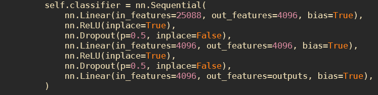

# VGG16

## 01

dataset: train_val_test_dataset (그냥 6:2:2로 나눈 데이터) 
batch_size = 128 
lr = 0.001 
처음에 돌렸을 때 test loss가 변경되지 않아 지금의 learning rate를 줄일 필요가 있음을 의미한다. 

## 02

dataset: train_val_test_dataset 
batch_size = 128 
lr = 0.01 
stepLR, gamma = 0.1, step_size = 100 

Train_loss을 출력해서 gd가 이뤄지고 있는지까지 확인하고자 했는데 결과,  2.35에서 줄어들지 않음을 알 수 있고, 이는 learning rate를 줄이게 되었다.

## 03

dataset: train_val_test_dataset 
batch_size = 128 
lr = 1e-6 

## 04

dataset: augmented_dataset (affine과 rotation만 적용하여 밸런스를 맞춘 데이터 셋) 
batch_size = 256 
lr = 1e-6 

Batch_size가 늘어났을 때의 경향을 보기 위해 256으로 늘렸다.

## 05

dataset: augmented_dataset 
batch_size = 256 
lr = 1e-6 

## 06

dataset: random_augmented_dataset (rotation만 적용한 데이터 셋은 다양하지 않다고 판단하여, 6가지 augmentation을 랜덤하게 사용하여 만든 데이터 셋, 최대 원래 데이터의 7배까지 augmentation), rotation을 적용하는 것보다는 허용범ㅁ위가 넓어짐 
batch_size = 128 
lr = 1e-6 

전의 augmentation dataset은 affine 하나와 rotation으로만 이루어져 있다. 하지만 좀 더 다양한 augmentation을 적용시킴으로써 general한 augmentation을 하기 위해 시도했다.

그리고 batch_size를 다시 낮춘 이유는 lr이 낮을 때, batch_size도 낮은 값이 좋다는 결과를 (예지가 발견, https://www.sciencedirect.com/science/article/pii/S2405959519303455#fig2 <- 이 논문 리뷰 보다가 발견) 발견했기 때문이다.

## 07

dataset: random_augmented_dataset_v2 (random_augmented_dataset에서 augmentation 배수를 12배로 증가시킨 데이터 셋) 
batch_size = 128 
lr = 1e-6 

Random_augmented_dataset은 최대 7배까지만 데이터를 증가시킨다. 하지만 이렇게 해도 데이터가 너무 적은 클래스가 존재하여, 최대 12배까지 늘린 random_augmented_dataset_v2를 만들었다.

## 08

focal_loss 사용 
dataset: random_augented_dataset 
batch_size = 128 
lr = 1e-6 

Focal loss를 사용하여 07과 같은 테스트를 진행

## 09

focal_loss 사용 
dataset: random_augmented_dataset_v2 
batch_size = 128 
lr = 1e-6 

 
 

## 10

focal_loss 사용 
dataset: random_augmented_dataset_v3 (L2_25, L2_30을 80%까지 줄이고 random_augmented_dataset과 동일한 코드로 augmentation한 데이터 셋 (최대 7배)) 
batch_size = 128 
lr = 1e-6 

 
 

test_10부터 lr 3e-6에서 30epoch, 2e-6에서 50epoch, 1e-6에서 100epoch 

> test_loss가 증가했음에도 불구하고 f1-score가 올라간 경우가 발견되었다. 이는 예측의 확신은 떨어졌지만 결국 예측을 잘하게 된 경우라고 생각된다.

## 11

focal_loss 사용 
dataset: random_augmented_dataset_v4 (L2_25, L2_30을 60%까지 줄이고 random_augmented_dataset과 동일한 코드로 augmentation한 데이터 셋 (최대 7배)) 
batch_size = 128 
lr = 1e-6 

random_augmented_dataset_v3가 더 좋은 데이터 셋이라고 판단, 따라서 이제부터 random_augmented_dataset_v3로 실험을 진행

## 12

focal_loss 사용 
dataset: random_augmented_dataset_v3
batch_size = 128 
lr = 1e-6 

아래의 주소에서 소개된 WeightedRandomSampler를 사용하여 테스트 진행 
<https://www.kaggle.com/code/maulberto3/mnist-simple-pytorch-cnn-3-layer-98/notebook?scriptVersionId=87318629&cellId=6> 

> WeightedRandomSampler: imbalance 데이터에서 batch 데이터를 가져올 때, balance하게 가져오기 위한 샘플링 방법

# ResNet18

## 01

dataset: augmented_dataset 
batch_size = 256 
lr = 0.0003 
stepLR, gamma = 0.1, step_size = 30, last_epoch = 30 * 2 

 
 

## 02

dataset: random_augmented_dataset 
batch_size = 256 
lr = 1e-6 

 
 

# ResNet50

Resnet50는 다음 논문에 소개되어 있다. 
<https://arxiv.org/pdf/1512.03385v1.pdf> 
**위 논문의 table-6를 참고하여 ResNet101도 테스트 하기로 결정했다.**

torchvision의 소스코드를 참고하여 ResNet50 class를 만들었다. 
<https://github.com/pytorch/vision/blob/6db1569c89094cf23f3bc41f79275c45e9fcb3f3/torchvision/models/resnet.py#L124>

## 01

focal_loss 사용 
dataset: random_augmented_dataset_v3 (L2_25, L2_30을 80%까지 줄이고 random_augmented_dataset과 동일한 코드로 augmentation한 데이터 셋 (최대 7배)) 
batch_size = 128 
lr = 1e-6 

 
 

**test_loss의 수렴값이 너무 커서 learning rate를 줄이고 학습하기로 결정했다.**

## 02

focal_loss 사용 
dataset: random_augmented_dataset_v3 (L2_25, L2_30을 80%까지 줄이고 random_augmented_dataset과 동일한 코드로 augmentation한 데이터 셋 (최대 7배)) 
batch_size = 128 
lr = 2e-6 ~ 1e-7 

 
 

2e-6, 1e-6 에서 10 epoch 씩 학습하고, 나머지는 1e-7에서 학습했다.

**train_loss가 줄어듦에도, test_loss가 줄어들지 않는다.(results폴더 확인) 따라서 learning rate의 문제가 아니라고 확신했고, ResNet101을 사용해 보기로 결정**

# ResNet101

## 01

focal_loss 사용 
dataset: random_augmented_dataset_v3 (L2_25, L2_30을 80%까지 줄이고 random_augmented_dataset과 동일한 코드로 augmentation한 데이터 셋 (최대 7배)) 
batch_size = 128 
lr = 3e-6 ~ 1e-6 

3e-6을 10 epoch, 2e-6을 20 epoch 그리고 나머지를 1e-6에서 학습했다.

 
 

**VGG16와 비교해 뛰어난 성능을 보여줄 것이라 예상했지만(논문의 결과에 의겨하여), 별로 결과가 좋지 못했다. 따라서 loss function에서 문제가 있는지 확인하기 위해 다시 Cross Entropy Loss를 사용하도록 하겠다.**

## 02

Cross Entropy Loss 사용 
dataset: random_augmented_dataset_v3 (L2_25, L2_30을 80%까지 줄이고 random_augmented_dataset과 동일한 코드로 augmentation한 데이터 셋 (최대 7배)) 
batch_size = 128 
lr = 3e-6 ~ 1e-6 

 
 

Cross Entropy를 사용했지만 VGG16보다 좋은 성능을 보이지 못함

## 03

Focal Loss 사용 
dataset: random_augmented_dataset_v4 (L2_25, L2_30을 80%까지 줄이고 random_augmented_dataset과 동일한 코드로 augmentation한 데이터 셋 (최대 7배)) 
batch_size = 128 
lr = 3e-6 ~ 1e-6 

 
 

**ResNet이 imbalance에 더 민감한 모델일 수 있다고 생각하여, random_augmented_dataset_v4로 시도했지만 결과는 좋지 못함**

# VGG16_v2

**VGG16은 1000개의 클래스를 구분하기 위해 만들어졌다. 하지만 이번 task는 20개의 클래스만을 가진다. 즉, 20개의 출력단을 가진다. 따라서 다음과 같이 VGG16 마지막단의 fully connected layer를 수정했다.** 

 
*VGG16*

 
*VGG16_v2*

## 01

focal_loss 사용 
dataset: random_augmented_dataset_v3 (L2_25, L2_30을 80%까지 줄이고 random_augmented_dataset과 동일한 코드로 augmentation한 데이터 셋 (최대 7배)) 
batch_size = 128 
lr = 1e-6 
